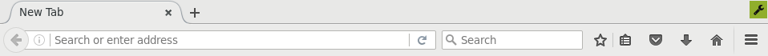
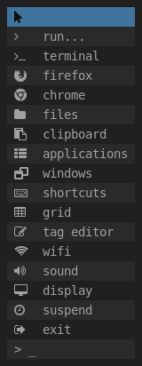

About
-----

Flatter window manager is highly conservative, inflexible, old generation
window manager:

* no bells no whistles ;)
* non-reparenting
* no title bars
* no ICCCM nor EWMH compliancy
* sloppy focus
* floating and to some extent tiling
* window tagging (aka virtual desktops)
* both mouse-only and keyboard-only modus operandi are possible
* [panel](screenshots/panel.png) per physical output
* system tray and custom dock support for only one of the panels

"Flatter" name is borrowed from blacksmithing world.

Window management
-----------------

__Toolbox__



Window manager does not render title bars but instead it offers small toolbox
that is displayed in one of visible corners of active window. So far there are
only two actions bound to the toolbox:

1) long press activates window move mode
2) click activates toolbar

__Toolbar__


Toolbar becomes visible on the panel right after tags bar and provides some
set of tools to manipulate window position and status (close, anchor). Toolbar
can also be activated by __Mod+F4__.

Windows are freely moveable with mouse however not with keyboard. Keyboard
based actions are limited to:

* windows cycling clockwise __Mod+Tab__ and anti-clockwise __Mod+Backspace__
* tags cycling __Mod+PageUp__ and __Mod+PageDown__
* window re-tagging __Mode+Home__ and __Mod+End__
* raise focused window above the others __Mod+Enter__
* split current tag (virtual desktop) into grid __Mod+F3__
* locate window at the tag's [*]:
  - center __Shift+F10__
  - top-left __Shift+F5__
  - top-right __Shift+F6__
  - bottom-left __Shift+F7__
  - bottom-right __Shift+F8__
  - fill-left half __Mod+F5__
  - fill-right half __Mod+F6__
  - fill-top half __Mod+F7__
  - fill-bottom half __Mod+F8__

  [*] repeating some of the actions will decrease or increase windows size
      towards selected direction.
* __Mod+F2__ toggles [anchor mode](screenshots/anchor-mode.png) of currently
  focused window making all consequent grid operations to have effect only on
  the rest of the windows on the current tag.

Default __Mod__ key is __Left Alt__.

Some mouse-only mode highlights:

* while window in motion is locked with mouse pointer it is possible to
  perform all window location related actions except for window centering:
  e.g. fill-left half of the output can be done by dragging window to output's
  left edge and release mouse button once [edge indicator](screenshots/fill-left.png)
  is shown
* [retag](screenshots/retag.png) window by hovering pointer over tag name
* clockwise window cycling can be done by repeatedly clicking on the title area of
  the panel bar

Window can only be closed from toolbar:


Window manager utilities
------------------------

__Main menu__



Window manager comes with set of standalone utilities that help navigation
through window manager space and some more:

* main menu __Mod+m__
* lock screen __Ctrl+Alt+Delete__
* spawn default terminal __Mod+t__
* run a command __Mod+r__
* jump tag __Mod+j__
* tag editor __Mod+e__
* switch output __Mod+o__
* installed applications list __Mod+p__
* clipboard selection __Mod+v__
* key bindings cheat sheet __Mod+k__

etc.

__Dock area__


Some rudimentary system configuration and monitoring tools are also available
in default window manager configuration e.g. battery and AC indicator, CPU load
monitor, display configurator, sound volume control, WiFi and LAN settings.

All utilities are written in C and POSIX shell to minimize system requirements
and dependencies.

Build dependencies
------------------

- xcb (core, randr, util, keysyms, xkbcommon, xkbcommon-x11)
- X11 (core, xcb)
- Xft

Installation
------------

From fwm's source directory run:

```
make all && make install all
```

Pay attention to some highlighted printouts during make run, e.g.
auto-generated _.xinitrc-fwm_ should replace _.xinitrc_ manually etc.

To make it possibile to maintain e.g. WiFi and LAN settings with help of fwm
utilities run:

```
sudo make install sudoers
```

The command above does following:

* creates _/etc/sudoers.d/fwm_ file with rules for __fwm__ group to which
  desired user should be added
* copies some system utilities to _/usr/sbin_ directory

Please note that some utilities need access to procfs and on some systems it
is disabled by default. E.g. Alpine Linux requires user to be part of
__readproc__ group in order to get such permissions. Sysfs access also could
be limited so check your distro for related security policies.

Running
-------

From the console run:

```
./startfwm
```

This will perform two actions:

1) lock current console (if _vlock_ utility is installed)
2) start fwm session

Customizations
--------------

* basic colors can be modified by editing files at _~/.fwm/colors/_
* key mappings can be modified by editing/creating files at _~/.fwm/keys/_
* pre-defined window positions are done by creating empty file with window
  class name at following directories:

  - _~/.fwm/center/_
  - _~/.fwm/top-left/_
  - _~/.fwm/top-right/_
  - _~/.fwm/bottom-left/_
  - _~/.fwm/bottom-right/_

* special windows like popup, dock etc.:

  - _~/.fwm/popup/_
  - _~/.fwm/screens/0/dock/_

Credits
-------

Despite the fact that fwm is written from scratch the work has been heavily
inspired by ideas behind [_dwm_](http://dwm.suckless.org/)

Another credit goes to [_Font Awesome_](http://fontawesome.io) creators: it
appeared to be very handy to use font icons instead of image based ones.

Thank you all!
